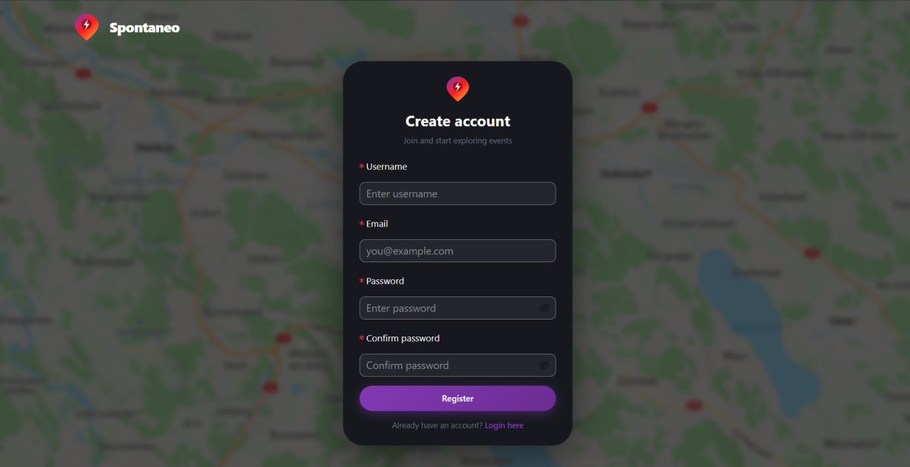
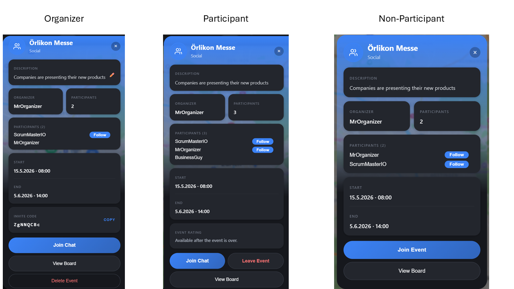
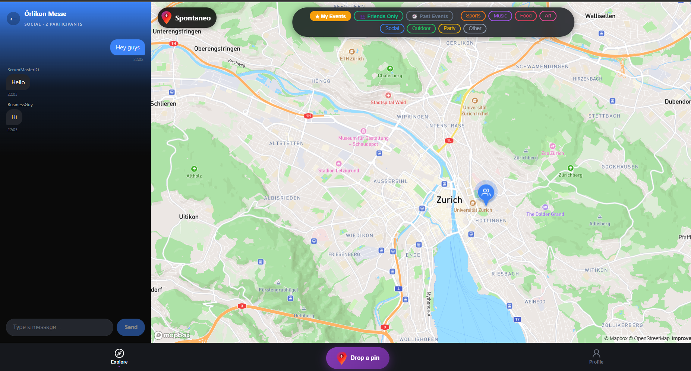
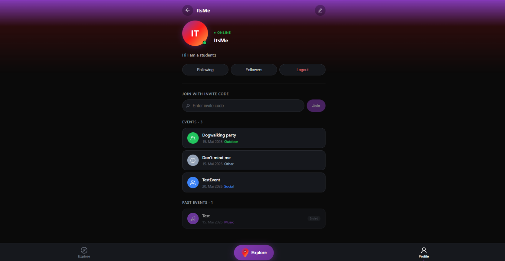
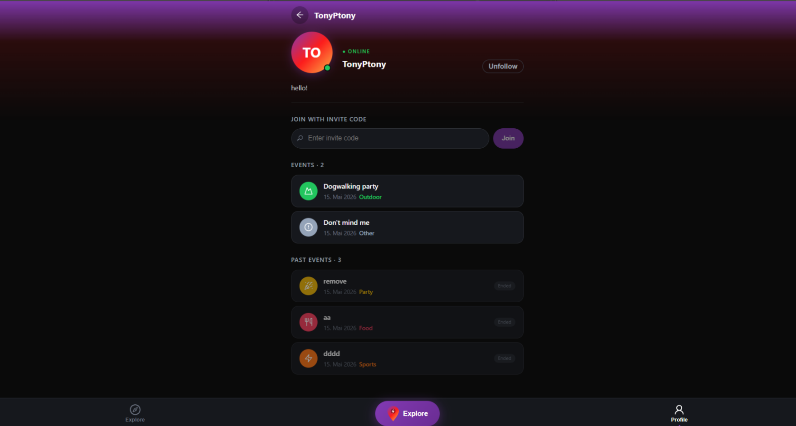

# SoPra FS26 – Group 21 · Frontend

## Introduction

Group 21 is building a **location-based event discovery app**: users open a map, see what's happening nearby right now, and join — public events with one click, private ones with an 8-character invite code shared by the organizer. Each event has its own chat (real-time STOMP/SockJS) and a shared "board" where participants drop photos, comments, and emoji. After it ends, attendees rate the organizer.

The motivation is to bridge the gap between social-network "events" (which assume you already know the host) and event-listing platforms (which feel impersonal): everything is anchored to a map, surfaced by proximity, and tied to a lightweight follow graph so you can also filter to events your friends are joining.

This repository contains the **Next.js / TypeScript frontend** deployed on **Vercel**. The Spring Boot backend lives in [`sopra-fs26-group-21-server`](https://github.com/claudioo2/sopra-fs26-group-21-server).

---

## Technologies used

- **Next.js 15** (App Router, Turbopack) · **TypeScript** · **React 19**
- **Ant Design 6** for UI primitives
- **Mapbox GL JS** for the map, with **`supercluster`** for marker clustering
- **`@stomp/stompjs` + `sockjs-client`** for the WebSocket-backed event chat
- **Deno / Nix** (via `flake.nix`) to pin the dev toolchain reproducibly
- **Vercel** for deployment · **GitHub Actions** for CI

---

## High-level components

1. **[`app/map/page.tsx`](./app/map/page.tsx) — The Map.** The central screen of the app. Initialises a Mapbox map, fetches `/events?lat&lng&radius=20` on every `moveend`, renders donut-shaped cluster markers (petals proportional to category count), supports spiderfy expansion for tightly-packed events, and hosts the create-event panel + event-detail modal. Filter state (categories, friends-only, my-events, past-events) is persisted in `sessionStorage`.

2. **[`app/api/apiService.ts`](./app/api/apiService.ts) — REST client.** Thin singleton around `fetch` that switches between `http://localhost:8080` (dev) and the App Engine URL (prod) via [`app/utils/domain.ts`](./app/utils/domain.ts). Used by every page through the [`useApi`](./app/hooks/useApi.tsx) hook. Auth tokens are passed as `Authorization: Bearer <token>` (read from `localStorage` via [`useLocalStorage`](./app/hooks/useLocalStorage.tsx)).

3. **STOMP-over-SockJS chat client** — instantiated inline in [`app/map/page.tsx`](./app/map/page.tsx) when a participant opens an event's chat panel. Subscribes to `/topic/chat/{eventId}` and publishes to `/app/chat/{eventId}`. SockJS (not raw WebSocket) is required because App Engine Standard's front-end proxy blocks WebSocket upgrades.

4. **[`app/users/[id]/page.tsx`](./app/users/[id]/page.tsx) — Profile.** Combines user info, the follow / unfollow toggle, the View Following / View Followers modals, the join-by-invite-code form, and the upcoming-events list (with a red "Cancelled" badge for soft-deleted events still in their 24 h chat grace period). On the owner's own profile it also edits `username`, `email`, `password`, and `bio`.

5. **[`app/events/[id]/board/page.tsx`](./app/events/[id]/board/page.tsx) — Event Board.** Per-event timeline of `PHOTO` / `COMMENT` / `EMOJI` posts (photo uploads restricted to JPEG/PNG). Only event participants can view or post.

The Map talks to the REST client to fetch events, the REST client hits the backend, and the STOMP client takes over for real-time messaging once a chat is opened. Profile and Board are entered from the Map (event detail modal) or from the user table at `/users`.

---

## Launch & Deployment

### Prerequisites

- **macOS / Linux / WSL** — `git` and `curl` must be available.
- **Windows** — WSL 2 (Ubuntu) is required. Run the provided [`windows.ps1`](./windows.ps1) in an elevated PowerShell:
  ```powershell
  C:\Windows\System32\WindowsPowerShell\v1.0\powershell.exe -ExecutionPolicy Bypass -File .\windows.ps1
  ```
  Keep the repo inside the WSL filesystem (not on the Windows drive) to avoid I/O slowdowns.

### Install

```bash
git clone https://github.com/claudioo2/sopra-fs26-group-21-client
cd sopra-fs26-group-21-client
source setup.sh   # installs Nix, direnv, Node, and Deno reproducibly via flake.nix
```

If `setup.sh` fails, follow the [manual troubleshooting steps](#troubleshooting) at the bottom of this file.

### Environment

Create `.env.local` in the repository root:

```
NEXT_PUBLIC_MAPBOX_ACCESS_TOKEN=<your mapbox public token>
NEXT_PUBLIC_PROD_API_URL=<production backend URL>   # only needed for production builds
```

Without `NEXT_PUBLIC_PROD_API_URL`, [`app/utils/domain.ts`](./app/utils/domain.ts) always targets `http://localhost:8080`.

### Run

```bash
npm run dev       # dev server at http://localhost:3000 (Turbopack, hot reload)
npm run build     # production build
npm run lint      # ESLint
npm run fmt       # format with the Deno formatter
```

Every command is also available via Deno (`deno task dev`, etc.).

### External dependencies

- The **Spring Boot backend** must be running on `http://localhost:8080` (see [`sopra-fs26-group-21-server`](https://github.com/claudioo2/sopra-fs26-group-21-server)).
- A **Mapbox** account (free tier is enough) for the public access token.

### Tests

The client has **no automated test suite** at this time — testing is done by running the dev server and exercising the UI. End-to-end tests are on the roadmap below.

### Docker (optional)

Push to `main` automatically builds and pushes a Docker image to Docker Hub via GitHub Actions. To run it locally:

```bash
docker pull <dockerhub_username>/<dockerhub_repo_name>
docker run -p 3000:3000 <dockerhub_username>/<dockerhub_repo_name>
```

One-time setup (one team member): create a Docker Hub account whose username contains the group number (e.g. `sopra_group_21`), create a matching Docker Hub repository, and add the GitHub secrets `dockerhub_username`, `dockerhub_password` (a Docker Hub access token with read/write), and `dockerhub_repo_name`.

### Releases

Push to `main` → GitHub Actions runs [`.github/workflows/verceldeployment.yml`](./.github/workflows/verceldeployment.yml), which deploys the build to Vercel. There is no separate tagging step; the `main` branch is the production line.

---

## Illustrations

The client has four main user flows. They are entered after the initial login / register screens (which can be reached via the homepage).

<div align="center" style="margin-bottom: 50;">
    
    <br>
    Register page
</div>

<br>

<div align="center">
    
    <br>
    Login page
</div>

### 1. Map exploration → join an event

```
/login  →  /map
          ├─ donut clusters group nearby events by category
          ├─ click a cluster → zoom in or spiderfy
          ├─ click a pin → event detail modal
          └─ modal: "Join" button (public) or invite-code prompt (private)
```

The map opens immediately on Zurich while geolocation resolves in the background, then `flyTo`s the user's position once `navigator.geolocation` succeeds (3-second timeout). Filter toggles (category, Friends-Only, My Events, Past Events) persist in `sessionStorage` so a refresh does not reset the view.

<div align="center">
    
    <br>
    Map page
</div>

<br>

You can select the pins to view the events. Depending on your role as creator, participant or non-participant, the event view will appear differently:

<div align="center">
    
    <br>
    If you are looking for an event to partcipate then you can join through the "Join Event" button
</div>

### 2. Create an event

```
/map  →  right-side "Create event" panel
          ├─ Mapbox Geocoding search (500 ms debounce) for the address
          ├─ green pin overlay = submitted coordinates
          └─ POST /events  →  new pin appears for everyone on next moveend
```
If you want to create an event then you can click on the "Drop a pin" button which is located in the middle of 
the navigation bar (at the bottom of the map page). This will open a creation form and a pin that can be dropped on the
desired location.

The creator is auto-added as the first participant, and the server generates a unique 8-character invite code visible only to them.

<div align="center">
    
    <br>
    To create an event, set the position of the event and fill out the creation form
</div>

### 3. Real-time chat

```
event modal  →  "Open chat"
                ├─ REST: GET /events/{id}/messages  (history)
                ├─ STOMP/SockJS connect on /ws
                ├─ subscribe /topic/chat/{eventId}
                └─ publish /app/chat/{eventId}  (token in body)
```
The chat can be found on the event-view and by clicking on the "Join Chat" button.

The chat survives a soft-delete: when the organizer cancels an event the row is kept for **24 hours** so participants can still coordinate. After that the cleanup job hard-deletes the event.

<div align="center">
    
    <br>
    Chat with other participants in real-time
</div>

### 4. Profile, follow, rate

```
/users/[id]
  ├─ Follow / Unfollow toggle (other users)
  ├─ View Following / View Followers modals
  ├─ Join by invite code
  ├─ Upcoming events list (cancelled events get a red badge)
  └─ Rate the organizer (visible only after the event ends)
```
The profile page, which can be reached by clicking on the profile icon on the navigation bar, appears different depending
on the user (if it's you or some other user). There you can follow and unfollow other users, see their events and ratings, 
edit your account, and join events through shared invitation codes. 

Ratings are 1–5 stars, one per (user, event) — the DB enforces a `UNIQUE(rater_id, event_id)` constraint and a second submission returns `409`.

<div align="center">
    
    <br>
    Profile page (own profile)
</div>

<br>

<div align="center">
    
    <br>
    Profile Page (profile of a friend)
</div>

---

## Roadmap

The top features new contributors could pick up next:

1. **End-to-end test suite (Playwright).** The client currently has no automated tests. A Playwright suite covering the four flows above (login → map, create-event, chat round-trip, rate-after-end) would dramatically improve regression safety.
2. **In-app cancellation notifications.** The backend already broadcasts `/topic/events/{eventId}/cancelled` when an organizer deletes an event, but the client does not subscribe yet — it only sees the cancellation on the next `moveend` fetch. Subscribing on the map (and on the profile page) would give participants an instant toast + automatic UI refresh.
3. **Search / autocomplete on the map.** Today users navigate by panning; an address search box that pans the map to a given location (re-using the existing Mapbox Geocoding call from the create-event panel) would make discovery much faster.

---

## Authors and acknowledgment

Group 21, FS26, University of Zurich — SoPra (Software Engineering Lab):

- **[@claudioo2](https://github.com/claudioo2)**
- **[@GabrielVuattoux](https://github.com/GabrielVuattoux)**
- **[@fra-a11y](https://github.com/fra-a11y)**
- **[@Pascal-Trautmann](https://github.com/Pascal-Trautmann)**
- **[@semirIbra](https://github.com/semirIbra)**

Many thanks to the SoPra teaching team and our TA for guidance throughout the semester. The project bootstrap is based on the official [`sopra-fs26-template-client`](https://github.com/HASEL-UZH/sopra-fs26-template-client) from the HASEL group at UZH.

---

## License

Licensed under the **Apache License 2.0** — see the [`LICENSE`](../sopra-fs26-group-21-server/LICENSE) file in the server repository for the full text.

---

## Troubleshooting

If `source setup.sh` fails repeatedly, run the following in a fresh terminal:

```bash
curl --proto '=https' --tlsv1.2 -ssf --progress-bar -L https://install.determinate.systems/nix -o install-nix.sh
sh install-nix.sh install --determinate --no-confirm --verbose
nix profile install nixpkgs#direnv
direnv allow
```

If `direnv` is not recognised after install, hook it into your shell following the [official guide](https://github.com/direnv/direnv/blob/master/docs/hook.md).

### Adding dev tools via Nix

Edit [`flake.nix`](./flake.nix):

1. Add the package to `nativeBuildInputs`:
   ```nix
   nativeBuildInputs = with pkgs; [ nodejs git deno watchman <new-package> ];
   ```
2. Export its binary path in `shellHook`:
   ```nix
   export PATH="${pkgs.<new-package>}/bin:$PATH"
   ```
3. Apply: `direnv reload`.

Pin a specific version via the `overlays` section.
